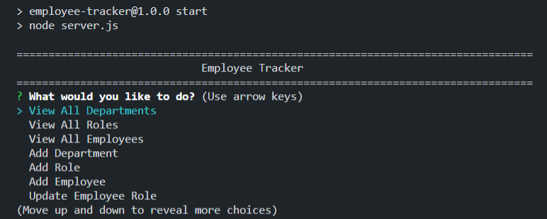

# Employee Tracker


## Description
Create a Content Management System that allow users to easily view and interact with information stored in databases. Using the command-line, users can use CMS interface to manage a company's employee database, using Node.js, Inquirer packages, and MySQL. In the employee database, users are able to view and manage departments, roles, and employees in the company.

## Table of Contents
1. [Installation](#installation)
2. [Task](#task)
3. [Usage](#usage)
4. [Screenshots](#screenshots)
5. [License](#license)
6. [Questions](#questions)

## Installation
Please install the following dependencies in the terminal to run the application. 
* [npm inquirer package](https://www.npmjs.com/package/inquirer)
* [npm mysql2 package](https://www.npmjs.com/package/mysql2)
* [npm console.table package](https://www.npmjs.com/package/console.table)
* Install MySQL Workbench 
  * For Windows user: [Windows(x86, 32-bit), MSI Installer](https://dev.mysql.com/downloads/installer/)
  * For Mac user: [See guide for installing MySQL on Mac.](https://dev.mysql.com/doc/mysql-macos-excerpt/5.7/en/macos-installation.html)

## Task
In order to use this application, the following requirements are met when:
```md
- I am presented with the following options: view all departments, view all roles, view all employees, add a department, add a role, add an employee, and update an employee role.

- WHEN I choose to view all departments:
THEN I am presented with a formatted table showing department names and department ids.

- WHEN I choose to view all roles:
THEN I am presented with the job title, role id, the department that role belongs to, and the salary for that role.

- WHEN I choose to view all employees:
THEN I am presented with a formatted table showing employee data, including employee ids, first names, last names, job titles, departments, salaries, and managers that the employees report to.

- WHEN I choose to add a department:
THEN I am prompted to enter the name of the department and that department is added to the database.

- WHEN I choose to add a role:
THEN I am prompted to enter the name, salary, and department for the role and that role is added to the database.

- WHEN I choose to add an employee:
THEN I am prompted to enter the employee’s first name, last name, role, and manager, and that employee is added to the database.

- WHEN I choose to update an employee role:
THEN I am prompted to select an employee to update and their new role and this information is updated in the database.
```

## Usage 

1. Clone this repository to receive all of the files

2. Install Dependencies: All NPM packages required for this application (Express, Compression, Mongoose, Lite-Server and Morgan) are already listed as dependencies in the package.json file. Run the command 'npm i' command in your terminal at the root directory level to install the packages.
Ensure you have Node.js installed on your machine. The application will be invoked by entering node server.js in the command line.

3. Set up your environment variables in a .env file

4. Initialize your database by running the "schema.sql" file with MySQL

5. Populate the existing database items by running "npm run seed" in your terminal

6. Run "npm start" to start the application's connection

7. You should now be able to view, add, and delete in the database

## Screenshots


## License
This project is covered under MIT.

## Questions
For inquiries about the repo, you can find me through GitHub at [inna-arabejo](https://github.com/inna-arabejo). 
For any additional questions, you can reach me through my email at [iarabejo3@gmail.com](mailto:iarabejo3@gmail.com).